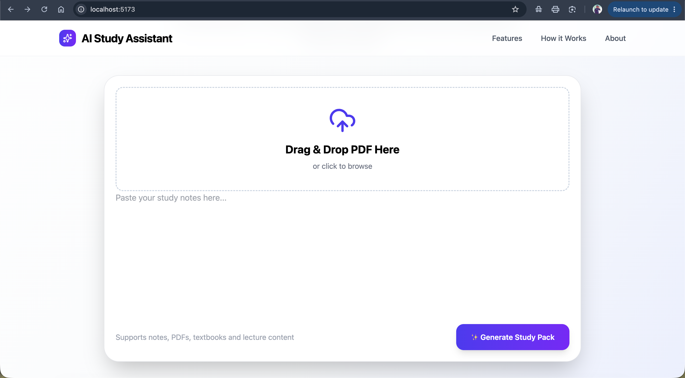
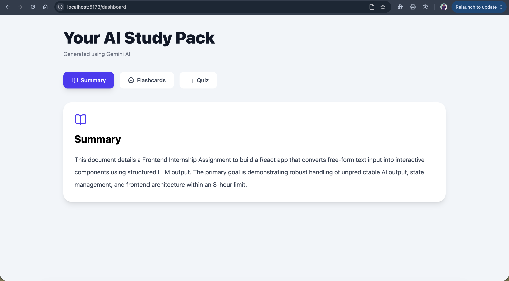
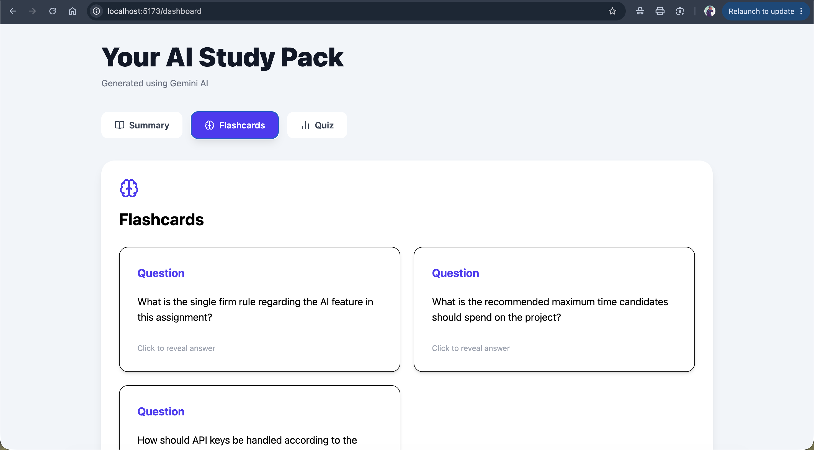
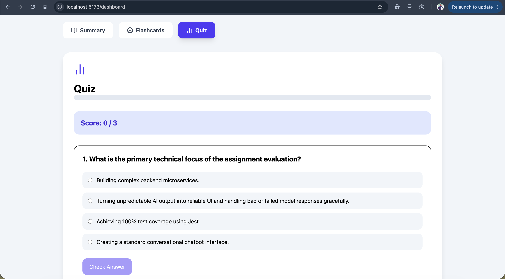

# AI Study Assistant

An AI-powered Study Assistant built with React, Node.js, Express, MongoDB, and Google Gemini API. The application converts free-form study notes or topics into structured learning material, including summaries, flashcards, and quizzes, presented through an interactive user interface.

This project was developed as part of a Frontend Internship assignment focusing on AI integration, structured data rendering, and robust frontend architecture.

---

## Features

- Generate study material from free-form text
- AI-generated summaries
- Interactive flashcards
- AI-generated quizzes
- Study history
- Responsive user interface
- Secure backend API integration
- Loading and error states
- Protected Gemini API key using an Express backend

---

## Tech Stack

### Frontend

- React (Hooks & Functional Components)
- Vite
- Tailwind CSS
- Axios

### Backend

- Node.js
- Express.js
- MongoDB Atlas
- JWT Authentication

### AI

- Google Gemini API

---

## Project Structure

```
AI-Study-Assistant
│
├── client
│   ├── src
│   ├── public
│   └── package.json
│
├── server
│   ├── controllers
│   ├── routes
│   ├── models
│   ├── services
│   └── package.json
│
└── README.md
```

---

## Installation

### 1. Clone the repository

```bash
git clone https://github.com/asimshaik1/AI-Study-Assistant.git
```

### 2. Navigate to the project

```bash
cd AI-Study-Assistant
```

### 3. Install frontend dependencies

```bash
cd client
npm install
```

### 4. Install backend dependencies

```bash
cd ../server
npm install
```

---

## Environment Variables

Create a `.env` file inside the `server` directory.

```
PORT=5000
MONGO_URI=YOUR_MONGODB_CONNECTION_STRING
JWT_SECRET=YOUR_SECRET_KEY
GEMINI_API_KEY=YOUR_GEMINI_API_KEY
```

---

## Running the Application

### Start Backend

```bash
cd server
npm start
```

### Start Frontend

```bash
cd client
npm run dev
```

Open:

```
http://localhost:5173
```

---

## How It Works

1. Enter study notes or a topic.
2. The request is sent to the Express backend.
3. The backend securely calls the Google Gemini API.
4. Gemini returns structured study content.
5. The frontend parses the response and renders:
   - Summary
   - Flashcards
   - Quiz
6. Users can review generated study material interactively.

---

## AI Usage

Google Gemini API is used to generate structured study content including summaries, flashcards, and quizzes.

AI-assisted tools (ChatGPT) were used for:
- Debugging
- Prompt refinement
- Code explanations
- Documentation improvements

All application logic, integration, and implementation were completed and understood by the developer.

---

## Error Handling

The application includes:

- Loading state during AI generation
- Error messages for failed requests
- Backend API error handling
- Validation for missing input

Future improvements include:
- Retry mechanism
- Malformed JSON recovery
- Better handling of unexpected AI responses
- Preventing stale AI responses from overwriting newer results

---

## Known Limitations

- AI responses may occasionally vary in quality.
- Large inputs may increase response time.
- Requires valid Gemini API credentials.
- Current implementation assumes valid structured AI output.

---

## Time Spent

Approximately **8 hours** of active development.

---

## Future Improvements

- Retry failed AI requests
- Better validation of AI-generated JSON
- Streaming AI responses
- Dark mode
- Keyboard shortcuts
- Drag-and-drop PDF upload
- Session export/import

---

## Screenshots

### Home Page



### Dashboard



### Flashcards



### Quiz



---

## Demo

Include a short screen recording demonstrating:

- Generating study material
- Flashcards
- Quiz
- Study history
- Error handling (if applicable)

---

## Author

**Asim Shaik**

GitHub:
https://github.com/asimshaik1
